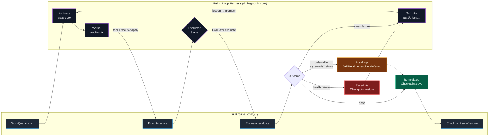

# System Architecture

This architecture was not designed top-down. It emerged from building
the system, running it, watching it fail, and fixing what broke. The
layer map below reflects where we ended up after 23 journal entries
of iteration — not where we planned to be on day one. Every component
choice has a story behind it, and most of those stories involve
trying something else first.

An overview of gemma-forge as a system, mapped onto the 5-Layer Enterprise AI
Partner Map. Each layer block shows (1) industry examples — both
open-source and enterprise-grade — so readers can see what alternatives
exist at each layer, (2) the components gemma-forge uses at that layer, and
(3) the architectural patterns that live primarily at that layer with links
to their deep treatments.

The patterns below apply **regardless of which vendor or open-source
alternative you choose** — they are properties of the layer, not of any
specific implementation. That is the transfer value of this project: the
ideas travel, even when the tool choices don't.

## The architecture at a glance

The gemma-forge harness is a reflexion loop around four agent roles
plus a deterministic evaluator. Skills plug in through five Protocol
interfaces without touching the loop itself. The diagram below shows
how a single work item moves through the system:

The **black box** is the harness — the Ralph loop, agent role
machinery, memory tiers, and task graph. It doesn't know what
domain it's working on. The **gray box** is a skill — STIG,
CVE Response, or anything you write next. It provides the five
Protocol methods the harness calls. Cross-run memory, evaluation
triage, ordering constraints, and the deferred-verification
post-loop phase all live in the harness and work for any skill
that implements the interfaces correctly.

## The 5-Layer Stack with Components

Component-by-component view of where each piece of gemma-forge lives.
Layer bands match the [5-Layer Enterprise AI Partner Map](../../index.md)
colors used elsewhere on the site so the visual language is
consistent.

  

    5
    Application
    — where the user sees results
  

  

    

      
STIG Remediation Skill

      
DISA STIG on Rocky 9 via OpenSCAP + bash. 270 rules, the hard case.

    

    

      
CVE Response Skill

      
Vuls + <code>dnf advisory</code>, per-family reboot batching.

    

    

      
Dashboard

      
Next.js live + replay UI with rule heatmap and agent pipeline.

    

    

      
Journal Site

      
This static site — MkDocs Material on GitHub Pages.

    

  

  

    4
    Orchestration
    — where agents reason, reflect, and persist
  

  

    

      
Ralph Loop Harness

      
<code>gemma_forge/harness/ralph.py</code> — the outer reflexion loop, skill-agnostic.

    

    

      
Google ADK

      
Per-agent-turn machinery, <code>FunctionTool</code> for tool calls.

    

    

      
Skills System

      
Five Protocol interfaces + optional <code>resolve_deferred</code>/<code>EmitEvent</code>.

    

    

      
V2 Memory Store

      
Postgres (episodic, structured tips) + Neo4j/Graphiti (reflective graph).

    

    

      
Structured Run Logger

      
JSONL event stream per run, replay-grade provenance.

    

  

  

    3
    Model
    — where inference happens
  

  

    

      
Gemma 4 31B Dense

      
bf16 full precision, native tool calling, 128K context.

    

    

      
vLLM 0.19.0

      
OpenAI-compatible REST, continuous batching, direct calls.

    

    

      
Tensor Parallel = 4

      
Model sharded across all four L4 GPUs, ~14 tok/s sustained.

    

  

  

    2
    Platform / MLOps
    — where you observe and measure
  

  

    

      
OpenTelemetry Collector

      
Ingests spans, metrics, logs from harness + vLLM.

    

    

      
Jaeger

      
Distributed tracing — per-request trace visualization.

    

    

      
Prometheus

      
Metrics TSDB — GPU telemetry, throughput, token counts.

    

    

      
Grafana

      
Dashboards and alerts over the above.

    

  

  

    1
    Infrastructure
    — the foundation
  

  

    

      
Dell PowerEdge XR7620

      
2U short-depth rugged edge server, 96 cores, 256 GB DDR5.

    

    

      
4× NVIDIA L4 (24 GB)

      
Single-slot inference GPUs, no NVLink, PCIe Gen4 ×16.

    

    

      
libvirt + KVM

      
Target VM virtualization; authoritative snapshot recovery.

    

    

      
Rocky Linux 9

      
The target VM — a RHEL 9 stand-in, same playbook applies.

    

    

      
OpenTofu + libvirt provider

      
Target VM infrastructure-as-code, Apache 2.0.

    

  

Below: each layer's full breakdown — industry alternatives
(open-source and enterprise) and the architectural patterns that
live primarily at that layer with links to their deep treatments.

## How to read this page

- **Layer** tells you *where in the stack* a thing sits. It answers
  "what kind of component is this?"
- **Pattern** tells you *what reusable design idea* the layer
  demonstrates. Patterns are the "click-down" concepts within each layer
  and each one has its own dedicated page under `architecture/`.
- **Industry** lists common alternatives so a reader can map the
  implementation back to their own environment. If you can't use what we
  used, the entries here are where you'd look instead.
- **Components** lists what gemma-forge actually runs at that layer.

---

## 5 — Application

*Vertical SaaS AI, end-user applications, domain-specific solutions.*

**Industry examples**
- **Harvey** — legal research and drafting (enterprise)
- **Veeva AI** — pharmaceutical and life sciences (enterprise)
- **Glean** — enterprise search and knowledge assistants (enterprise)
- **Open WebUI** — self-hosted chat-style application (open source)

**gemma-forge components**
- **STIG Remediation Skill** (`skills/stig-rhel9/`) — the anchor
  skill. DISA STIG compliance on a Rocky Linux 9 target via OpenSCAP
  scan + bash fix scripts. The hard case: 270 rules with complex
  inter-rule dependencies, multi-attempt fixes, and real target-
  breaking risk.
- **CVE Response Skill** (`skills/cve-response/`) — the second
  skill. Autonomous advisory remediation via Vuls + `dnf advisory`,
  with per-package-family reboot batching. The easy case: 44
  advisories remediated in 35 min, every one first-try. Shipped in
  [journey/35](../journey/35-building-cve-in-a-day.md) and hardened
  in [journey/37](../journey/37-per-family-reboot-batching-landed.md).
- **gemma-forge Dashboard** — Next.js live and replay UI that renders the
  Ralph loop event stream in real time, with a pipeline view, a current-
  step panel, and a scrollable event log.
- **gemma-forge Journal Site** — this static site, served by GitHub Pages,
  built from the project's engineering notes.

**Patterns at this layer**
- **skill-authoring** — the pattern that emerged once two skills
  shipped. A skill is a folder with a manifest, prompts, and a
  `runtime.py` that implements five Protocol interfaces
  (`WorkQueue`, `Executor`, `Evaluator`, `Checkpoint`,
  `SkillRuntime`). Plus optional extension points:
  `deferrable_failure_modes` on `EvaluatorMetadata`,
  `SkillRuntime.resolve_deferred` for long-running post-loop phases,
  and an `EmitEvent` progress callback. CVE added
  `FailureMode.NEEDS_REBOOT`, `DeferredItemOutcome`, and the
  `EmitEvent` callback to the harness without any changes to the
  Ralph loop itself. STIG never touches any of that code; it stays
  inert for skills that don't need it. See
  [adding-a-skill](../../adding-a-skill.md) for the current authoring
  guide.

---

## 4 — Orchestration

*RAG pipelines, agents, vector databases, LLM frameworks.*

This is where the Ralph loop itself lives, and where most of gemma-forge's
interesting architecture is concentrated. The four key patterns below
all live at this layer.

**Industry examples**
- **LangChain / LangGraph** — the most comprehensive OSS ecosystem with
  a strong commercial tier; LangGraph is the recommended agent surface
  for any workflow that needs loops, conditionals, or state persistence
  (open source + commercial)
- **Microsoft Agent Framework** — the merged successor to AutoGen and
  Semantic Kernel, GA targeted for early 2026 (open source core,
  enterprise support)
- **LlamaIndex** — data-centric retrieval and indexing, strong for
  RAG-heavy workloads (open source + commercial)
- **CrewAI** — role-based multi-agent collaboration, good for team-
  oriented workflows (open source + commercial)
- **Google ADK** — the agent development kit used in this project (open
  source, Apache 2.0)
- **Vector stores** — Pinecone, Qdrant, Weaviate, Milvus (mixed OSS and
  enterprise; gemma-forge does not currently use a vector store)

**gemma-forge components**
- **Google ADK (Agent Development Kit)** — pre-1.0 but stable enough for
  `LoopAgent` and `FunctionTool` use. Provides the agent turn abstraction
  and the tool-calling machinery.
- **Ralph Loop Harness** — the project's own implementation in
  `gemma_forge/harness/ralph.py`. Wraps ADK with an outer reflexion loop,
  per-rule retry logic, wall-clock time budgeting, architect re-engagement,
  and integrated diagnostics.
- **Four agent roles** — Architect (plans), Worker (executes), Reflector
  (analyzes failures), and Eval (deterministic, non-LLM verdicts). All
  three LLM roles currently run on Gemma 4 31B bf16.
- **Skills system** — `skills/*/skill.yaml` + prompts + `runtime.py`
  implementing the five Protocol interfaces. STIG (`skills/stig-rhel9/`)
  and CVE (`skills/cve-response/`) both ship today; the harness
  loads whichever is named on the command line.
- **Episodic + semantic memory** — per-rule distilled lessons plus
  cross-rule banned patterns and strategic lessons, all token-budgeted
  and assembled by an explicit prompt assembler.
- **Run logger** — structured JSONL event stream, one record per event,
  suitable for replay and post-run analysis.

**Patterns at this layer**
- **reflexion-loop** — persistence, retry-with-learning, plateau
  detection, architect re-engagement. See
  [`01-reflexive-agent-harness-failure-modes`](01-reflexive-agent-harness-failure-modes.md).
- **tool-calling** — agent action budgets, agent-turn discipline, the
  model↔tool contract. Worker caps at one tool call per turn by default.
- **context-management** — deterministic token-budget-aware prompt
  assembly, distilled episodic memory, capped semantic memory.
- **snapshot-revert** — the decision layer for target recovery. Diagnoses
  first, then restores a libvirt snapshot. The *mechanism* lives in L1;
  the *policy* lives here.

---

## 3 — Model

*Foundation models, LLMs, specialized AI models, and the inference
engines that run them.*

**Industry examples**
- **Gemma 4 family** — Google's open-weights line, used in this project
  (open source, Apache 2.0)
- **Llama 3.x** — Meta's open-weights flagship, dominant in enterprise
  open-source deployments (open source, Llama license)
- **Mistral / Mixtral** — European open-weights with strong
  cost/performance, including a commercial tier (open source +
  commercial)
- **GPT-5, Claude, Gemini API** — frontier proprietary models from
  OpenAI, Anthropic, and Google (enterprise, proprietary)
- **Phi-3, Qwen, DeepSeek** — leading small-language-models suited for
  edge deployment (open source)

**Inference engines**
- **vLLM** — the high-throughput OSS inference engine used in this
  project (open source, Apache 2.0)
- **NVIDIA Triton Inference Server** — NVIDIA's production serving
  framework, currently awaiting a vLLM-backend version gap before it
  can run Gemma 4 (open source, NVIDIA-supported)
- **TensorRT-LLM** — NVIDIA's lowest-latency runtime for Blackwell and
  Ada-class GPUs (open source + NVIDIA-enterprise)
- **NVIDIA NIM** — NVIDIA's microservices packaging of the above,
  license-gated (enterprise)

**gemma-forge components**
- **Gemma 4 31B bf16** — the sole LLM used for Architect, Worker, and
  Reflector roles. Full precision, no quantization.
- **vLLM 0.19.0** — OpenAI-compatible REST API, direct calls (no proxy,
  no LiteLLM per the supply-chain decision in
  [`journey/03-observability`](../journey/03-observability.md)).
- **`gemma-forge/vllm:latest`** — a small custom image derived from
  `vllm/vllm-openai` with `transformers>=4.58` baked in to recognize the
  `gemma4` model type.
- **Tensor-parallel 4-way** — the 31B model split across all 4 NVIDIA
  L4 GPUs with `--tensor-parallel-size 4 --dtype bfloat16 --enforce-eager`.

**Patterns at this layer**
- **parallelism** — TP/PP choice, NVLink vs PCIe, multi-GPU bandwidth.
  See [`journey/10-the-parallelism-maze`](../journey/10-the-parallelism-maze.md).
- **quantization** — NVFP4 vs bf16 tradeoffs, the VRAM math, when
  quantization helps versus hurts throughput. See
  [`journey/02-model-strategy`](../journey/02-model-strategy.md) and
  [`gotchas/nvfp4-vram-math`](../gotchas/nvfp4-vram-math.md).

---

## 2 — Platform / MLOps

*Training pipelines, experiment tracking, model monitoring, feature
stores, and LLM observability.*

**Industry examples**
- **Langfuse** — self-hosted LLM observability, prompt management, and
  evaluations; 21k+ GitHub stars, MIT license (open source + commercial
  cloud)
- **Arize AI** — enterprise ML and LLM observability; used at production
  scale by Uber, PepsiCo, Tripadvisor (enterprise)
- **Datadog LLM Observability** — extends an existing Datadog footprint
  with LLM-specific tracing (enterprise)
- **OpenTelemetry + Jaeger + Prometheus + Grafana** — standards-based
  observability, used in this project (open source, CNCF)
- **MLflow / Weights & Biases** — experiment tracking and model registry
  (open source / enterprise tiers)

**gemma-forge components**
- **OpenTelemetry collector** — ingests spans, metrics, and logs from the
  harness and the vLLM services
- **Jaeger** — distributed tracing backend; the run-by-run trace view
- **Prometheus** — metrics TSDB; GPU telemetry, run rates, token counts
- **Grafana** — dashboards and alerts over the above
- **Structured run logger** — JSONL event stream in `runs/run-*.jsonl`;
  the authoritative per-event record, independent of the OTel stack
- **`bin/forge`** — lifecycle management script for vLLM, FastAPI, and
  the Ralph loop process; single-command up/down/status

**Patterns at this layer**
- *(None declared yet.)* Observability at this layer is mostly
  infrastructure and tool selection rather than reusable design
  patterns. When a future pattern — e.g., "how to instrument a
  reflexive agent harness for post-hoc replay" — crystallizes, it
  lives here.

---

## 1 — Data / Infrastructure

*Storage, data lakes, compute infrastructure, hypervisors, and the
hardware that underlies everything above.*

**Industry examples**
- **Snowflake** — cloud data warehouse (enterprise)
- **Databricks** — unified data and AI platform (enterprise)
- **Weka** — high-performance AI storage fabric (enterprise)
- **MinIO / Ceph** — S3-compatible object storage (open source)
- **PostgreSQL + pgvector** — relational DB with vector extension (open
  source)
- **Proxmox VE / libvirt + KVM** — open-source virtualization (open
  source)
- **VMware vSphere** — enterprise virtualization (enterprise)

**gemma-forge components**
- **Dell PowerEdge XR7620** — the reference host. 2× Intel Xeon Gold
  6442Y (96 threads), 256 GB RAM, 4× NVIDIA L4 (24 GB each), no NVLink.
  The XR7620 is the lab environment; the techniques apply to any
  comparable platform.
- **Ubuntu 24.04** — the host OS
- **Docker** — used for the vLLM container serving, alongside existing
  production Docker workloads on the same box
- **libvirt + KVM** — the target VM virtualization layer
- **Rocky Linux 9** — the target VM, a binary-compatible RHEL 9
  stand-in for development. The same playbook drops into a real RHEL 9
  fleet.
- **OpenTofu + `dmacvicar/libvirt`** — target VM infrastructure as code,
  Linux Foundation governance, Apache 2.0
- **libvirt internal snapshots** — the authoritative recovery mechanism
  (`baseline` and rolling `progress`), the mechanism half of the
  `snapshot-revert` pattern declared at L4
- **`/data/gemma-forge/`** — host storage layout for VM state, weights,
  and logs, isolated from other workloads on the same box

**Patterns at this layer**
- *(None declared yet.)* Infrastructure in this project is
  deliberately unexciting — the target VM is Rocky 9, the hypervisor
  is libvirt, the IaC is OpenTofu. No new patterns discovered here
  because the goal was to use boring, well-understood components so
  the interesting work could happen at L3 and L4.

---

## Cross-layer patterns

Some patterns legitimately span multiple layers. The table below maps
each pattern to its *primary* layer (where most of its logic lives) and
any *secondary* layers it touches.

| Pattern | Primary | Secondary | Notes |
|---|---|---|---|
| `reflexion-loop` | L4-orchestration | — | The outer retry loop, architect re-engagement, plateau detection. |
| `tool-calling` | L4-orchestration | L3-model | The harness defines the contract, but the model's native tool-call support determines what's possible. |
| `context-management` | L4-orchestration | L3-model | The harness assembles and budgets the prompt; the inference engine enforces the window. |
| `snapshot-revert` | L4-orchestration | L1-data-infrastructure | Decision policy at L4, mechanism at L1. |
| `parallelism` | L3-model | — | TP/PP, multi-GPU, bandwidth. Choice is driven by model architecture. |
| `quantization` | L3-model | — | Precision vs memory tradeoffs, VRAM math, throughput impact. |

---

## Further reading

For the architectural contribution that came out of this project — a
taxonomy of six failure modes in reflexive agent harnesses with
prescribed harness mechanisms for each — see
[`01-reflexive-agent-harness-failure-modes`](01-reflexive-agent-harness-failure-modes.md).

For the narrative of how each layer was built, pick a layer from above
and follow the journey entries it links to. The journey entries are
first-person field notes with enough detail to reproduce the decisions.

For the gotchas — the small, atomic "X breaks Y because Z" lessons that
cost hours to discover — see the `gotchas/` directory. Each one is
scoped to a single layer and tagged accordingly.
