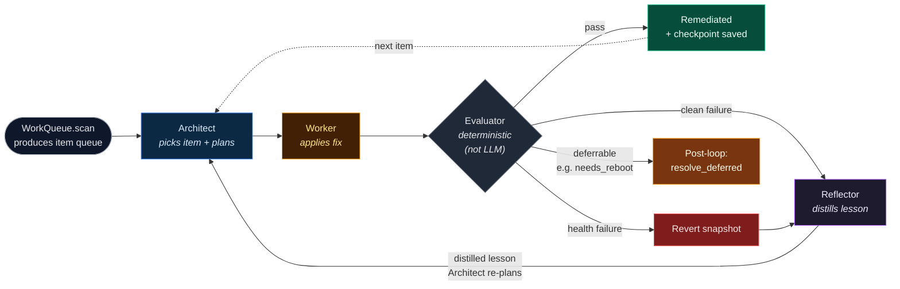
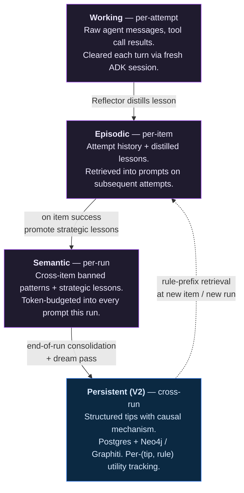

# System Architecture

This architecture wasn't designed top-down. It emerged from building
the system, running it, watching it fail, and fixing what broke.
Thirty-seven journal entries of iteration — plus two shipping
skills (STIG and CVE Response) — is where we ended up, not where we
planned to be on day one. Every component choice has a story behind
it, and most of those stories involve trying something else first.

The rest of this page is the map. Two diagrams give the mental
model: a flow view of the reflexion loop and a responsibility view
of the harness/skill boundary. A colored 5-layer stack below shows
what gemma-forge runs at each layer. Two tables at the bottom
consolidate industry alternatives and the architectural patterns
that are the actual transfer value — the ideas travel even when the
tool choices don't.

## The architecture at a glance

Two views of the same system:

1. **The reflexion loop** — how one work item moves through the
   four agent roles. This is the flow the live dashboard renders.
2. **The skill boundary** — what lives in the fixed harness
   versus what a skill provides through five Protocol methods.
   This is the thesis: the core doesn't change, the skills plug in.

### The reflexion + Ralph loop

Two feedback loops are overlaid here.

- **Solid arrow** (Reflector → Architect) — *reflexion within a
  single item.* When an attempt fails, the Reflector distills a
  lesson, and the Architect re-plans for the next attempt on the
  same item with that lesson in context. The lesson lives in
  *episodic* memory (per-item, ephemeral).
- **Dashed arrow** (Remediated → Architect) — *Ralph persistence
  across items.* When an item finishes (pass or escalate), the
  harness picks the next item from the queue and grinds on. The
  outer loop stops only when the queue is empty or the wall-clock
  budget is exhausted.

Neither arrow is where *cross-run memory* gets written. That
happens at item completion (promoting distilled lessons into
semantic memory for this run) and at end-of-run (promoting the
run's best signal — both successful approaches and failed-attempt
lessons — into persistent memory via the dream pass). That full
lifecycle is the next diagram.

Colors match the live dashboard's agent pipeline: Architect blue,
Worker amber, Reflector purple. All three are LLM roles running
on the same Gemma 4 deployment through fresh ADK sessions per
turn. The Evaluator is gray because it's not an LLM — it's
whatever skill-provided code decides whether the target is now in
the desired state (OpenSCAP for STIG, `dnf updateinfo` for CVE,
etc.).

### The skill boundary

The harness is fixed. Skills plug in through five Protocol methods.
The table below shows the same contract implemented two ways — once
for STIG, once for CVE. The Protocol column is the constant; the
right two columns change completely between skills. None of the
differences between STIG and CVE reach the Ralph loop; both skills
boot from the same `./bin/forge run <skill>` entry point.

  

    
Protocol method (when the harness calls it)

    
STIG the hard case — 270 rules

    
CVE Response the easy case — 44 advisories

  

  

    

      <code>WorkQueue.scan()</code>
      
once at run start — what items are we processing?

    

    
OpenSCAP scan against the DISA RHEL 9 STIG datastream; each failing rule becomes a <code>WorkItem</code>.

    
Vuls scan of installed packages against NVD + RHSA/RLSA feeds; each pending advisory becomes a <code>WorkItem</code>.

  

  

    

      <code>Executor.apply(item, ...)</code>
      
each Worker turn — take the action the Worker chose.

    

    
SSH in, run a bash fix script, capture stdout/stderr + exit code.

    
SSH in, run <code>dnf upgrade --advisory=&lt;ID&gt; -y</code>, capture results.

  

  

    

      <code>Evaluator.evaluate(item)</code>
      
after each apply — did the target reach the desired state?

    

    
Re-scan via OpenSCAP on a single rule + mission-app healthcheck. Returns <code>EvalResult(passed, failure_mode, summary)</code>.

    
<code>dnf updateinfo</code> for the advisory + mission-app healthcheck. Returns <code>EvalResult(...)</code>, possibly with <code>NEEDS_REBOOT</code> to trigger the deferred path.

  

  

    

      <code>Checkpoint.save() / .restore()</code>
      
on state transitions — protect forward progress, revert on failure.

    

    
libvirt atomic VM snapshots (<code>baseline</code> + rolling <code>progress</code>).

    
libvirt atomic VM snapshots + per-family snapshots (<code>pre-family-kernel</code>, etc.) for reboot-batch rollback.

  

  

    

      <code>SkillRuntime</code>
      
bundles the four above into the object the harness loads.

    

    
<code>StigSkillRuntime</code> — wires OpenSCAP tool paths, profile, datastream.

    
<code>CveSkillRuntime</code> — wires Vuls config, severity filter, SSH creds.

  

  

    

      <code>resolve_deferred(reason, items, emit)</code>
      (optional extension)
      
post-loop — resolve items that couldn't be verified in the moment.

    

    
not implemented — STIG declares <code>deferrable_failure_modes=[]</code>, so the harness never calls this for STIG.

    
Per-package-family batched apply + reboot + verify + family-scoped rollback. Emits <code>family_*</code> progress events for the UI.

  

The amber-tinted bottom row is the extension point CVE added. It
took one new dataclass (`DeferredItemOutcome`), one new callback
type (`EmitEvent`), and three new `FailureMode` enum values —
landing in a single commit to the harness. STIG never touches any
of it. Adding a third skill follows the same recipe: implement the
five interfaces, declare whether you need `resolve_deferred`, and
`./bin/forge run <your-skill>` boots the exact same Ralph loop.

### The four memory tiers

Memory flows outward from each agent turn into progressively
longer-lived stores. Each tier is scoped to a specific lifespan
and has a distinct retrieval discipline.

The **dashed arrow** from Persistent back to Episodic is the whole
point of the V2 memory rewrite: tips from prior runs get pulled
into the current item's context via rule-prefix similarity, so a
fresh run on Day 2 starts smarter than a fresh run on Day 1 without
any code changes. The dream pass promotes raw lessons into
structured tips with causal mechanism fields at run-end; the Phase
H eviction policy retires low-utility tips with enough evidence.
See [ADR-0016](../../adr/0016-graphiti-neo4j-postgres-memory-stack.md)
for why SQLite (V1) was retired, and [journey/30](../journey/30-building-v2.md)
for the V2 rewrite details.

## The event substrate: structured JSONL run logger

Every event the harness emits — agent turns, evaluator verdicts,
memory retrievals, checkpoint operations, tool calls, deferred-
verification progress, GPU snapshots — lands as a single JSON line
in `runs/run-<timestamp>.jsonl`. That file is not a debug log. It
is **the substrate**.

!!! info "Why this decision mattered"
    The structured run logger was built early (see
    [journey/12.5](../journey/12.5-structured-run-logger.md)) and
    became load-bearing for almost everything that came after:

    - **Live dashboard** — the `/api/live-stream` SSE endpoint tails
      the active JSONL and ships events to the UI.
    - **Replay UI** — client-paced replay streams the same JSONL
      through a RAF loop, so historical runs render with the same
      fidelity as live ones.
    - **Cross-run memory mining** — the V2 dream pass and
      consolidation phase read past JSONLs to distill structured
      tips. No JSONL, no cross-run learning.
    - **NIST-grade decision provenance** — the JSONL is the audit
      trail: every autonomous action, why it was taken, what the
      evaluator found, and what lesson was stored. Compliance is
      not a bolt-on; it's how the architecture works. See the
      alignment with the [NIST AI Agent Standards Initiative](https://www.nist.gov/caisi/ai-agent-standards-initiative).
    - **Post-mortems** — journey entries from Run 6 onward cite
      specific elapsed_s offsets in JSONL files. The narrative
      record and the execution record are the same record.

    The rule that keeps the substrate useful: **no event is
    observable that isn't JSONL-captured.** When we added
    family-level progress events to `resolve_deferred`
    ([entry 37](../journey/37-per-family-reboot-batching-landed.md)),
    they were JSONL-first; the UI rendering came after. OTel
    adds distributed tracing on top for SRE-style performance
    debugging, but JSONL is the authoritative record.

## The 5-Layer Stack with Components

Component-by-component view of where each piece of gemma-forge lives.
Layer bands match the [5-Layer Enterprise AI Partner Map](../../index.md)
colors used elsewhere on the site so the visual language is
consistent.

  

    5
    Application
    — where the user sees results
  

  

    

      
STIG Remediation Skill

      
DISA STIG on Rocky 9 via OpenSCAP + bash. 270 rules, the hard case.

    

    

      
CVE Response Skill

      
Vuls + <code>dnf advisory</code>, per-family reboot batching.

    

    

      
Dashboard

      
Next.js live + replay UI with rule heatmap and agent pipeline.

    

    

      
Journal Site

      
This static site — MkDocs Material on GitHub Pages.

    

  

  

    4
    Orchestration
    — where agents reason, reflect, and persist
  

  

    

      
Ralph Loop Harness

      
<code>gemma_forge/harness/ralph.py</code> — the outer reflexion loop, skill-agnostic.

    

    

      
Google ADK

      
Per-agent-turn machinery, <code>FunctionTool</code> for tool calls.

    

    

      
Skills System

      
Five Protocol interfaces + optional <code>resolve_deferred</code>/<code>EmitEvent</code>.

    

    

      
V2 Memory Store

      
Postgres (episodic, structured tips) + Neo4j/Graphiti (reflective graph).

    

    

      
Structured Run Logger

      
JSONL event stream per run, replay-grade provenance.

    

  

  

    3
    Model
    — where inference happens
  

  

    

      
Gemma 4 31B Dense

      
bf16 full precision, native tool calling, 128K context.

    

    

      
vLLM 0.19.0

      
OpenAI-compatible REST, continuous batching, direct calls.

    

    

      
Tensor Parallel = 4

      
Model sharded across all four L4 GPUs, ~14 tok/s sustained.

    

  

  

    2
    Platform / MLOps
    — where you observe and measure
  

  

    

      
OpenTelemetry Collector

      
Ingests spans, metrics, logs from harness + vLLM.

    

    

      
Jaeger

      
Distributed tracing — per-request trace visualization.

    

    

      
Prometheus

      
Metrics TSDB — GPU telemetry, throughput, token counts.

    

    

      
Grafana

      
Dashboards and alerts over the above.

    

  

  

    1
    Infrastructure
    — the foundation
  

  

    

      
Dell PowerEdge XR7620

      
2U short-depth rugged edge server, 96 cores, 256 GB DDR5.

    

    

      
4× NVIDIA L4 (24 GB)

      
Single-slot inference GPUs, no NVLink, PCIe Gen4 ×16.

    

    

      
libvirt + KVM

      
Target VM virtualization; authoritative snapshot recovery.

    

    

      
Rocky Linux 9

      
The target VM — a RHEL 9 stand-in, same playbook applies.

    

    

      
OpenTofu + libvirt provider

      
Target VM infrastructure-as-code, Apache 2.0.

    

  

## Industry Alternatives

How each layer maps to the broader ecosystem. If you can't use what
gemma-forge uses, these are the entries you'd look at instead. The
architectural patterns further down apply regardless of which
vendor or open-source alternative you pick — they are properties of
the layer, not of any specific implementation. That is the transfer
value of this project: the ideas travel, even when the tool choices
don't.

| Layer | Open source | Enterprise | gemma-forge |
|---|---|---|---|
| **5 — Application** | Open WebUI | Harvey, Veeva AI, Glean | STIG + CVE Response skills, Dashboard, this Journal |
| **4 — Orchestration** | LangChain / LangGraph, LlamaIndex, CrewAI, Google ADK | Microsoft Agent Framework | Ralph Loop + ADK + five Protocol interfaces + V2 memory (Postgres + Neo4j / Graphiti) |
| **3 — Model** | Llama 3.x, Mistral / Mixtral, Phi-3, Qwen, DeepSeek, Gemma 4 | GPT-5, Claude, Gemini API | Gemma 4 31B Dense bf16 |
| **3 — Model (inference engine)** | vLLM, NVIDIA Triton | TensorRT-LLM, NVIDIA NIM | vLLM 0.19.0, TP=4 across 4× L4 |
| **2 — Platform / MLOps** | OTel + Jaeger + Prometheus + Grafana, Langfuse, MLflow, W&B | Arize AI, Datadog LLM | OTel + Jaeger + Prometheus + Grafana |
| **1 — Infrastructure** | MinIO, Ceph, Postgres + pgvector, Proxmox VE, libvirt + KVM | Snowflake, Databricks, Weka, VMware vSphere | Dell PowerEdge XR7620 + 4× NVIDIA L4 + libvirt + Rocky 9 + OpenTofu |

A few notes on the choices that aren't obvious from the table:

- **L3 model serving without a proxy.** gemma-forge calls vLLM's
  `/v1/chat/completions` directly, no LiteLLM or commercial
  gateway — a direct consequence of the March 2026 supply-chain
  incident documented in
  [journey/03.5](../journey/03.5-litellm-observability-decision.md).
- **L1 infrastructure is deliberately unexciting.** Rocky 9 +
  libvirt + OpenTofu are well-understood, boring components. The
  interesting work lives at L3 and L4; L1 stays out of the way.
- **No vector store.** The V2 memory system uses rule-prefix
  similarity and Graphiti knowledge-graph queries rather than
  embedding search. See
  [ADR-0016](../../adr/0016-graphiti-neo4j-postgres-memory-stack.md)
  for the rationale.

## Architectural Patterns

Patterns are reusable design ideas that travel independent of which
vendor or open-source alternative you pick. The table maps each one
to the layer where most of its logic lives, any secondary layer it
touches, and the treatment that goes into the mechanism.

| Pattern | Primary | Secondary | Where it lives |
|---|---|---|---|
| **skill-authoring** | L5 | L4 | Five Protocol interfaces (`WorkQueue`, `Executor`, `Evaluator`, `Checkpoint`, `SkillRuntime`) plus optional `EvaluatorMetadata`, `DeferredItemOutcome`, and `EmitEvent`. See [adding-a-skill](../../adding-a-skill.md). |
| **reflexion-loop** | L4 | — | Outer retry loop, architect re-engagement, content-set plateau detection. See [Failure Modes §5](01-reflexive-agent-harness-failure-modes.md). |
| **tool-calling** | L4 | L3 | Per-turn action budget defaulting to 1. The harness defines the contract; the model's native tool-call support determines what's possible. See [Failure Modes §1](01-reflexive-agent-harness-failure-modes.md). |
| **context-management** | L4 | L3 | Deterministic prompt-budget assembly with distilled episodic memory. The harness assembles the prompt; the inference engine enforces the window. See [Failure Modes §6](01-reflexive-agent-harness-failure-modes.md). |
| **snapshot-revert** | L4 | L1 | Decision policy at L4, mechanism at L1. Hypervisor-level snapshots defeat anything the executor can break. See [Failure Modes §2](01-reflexive-agent-harness-failure-modes.md). |
| **deferred-verification** | L4 | — | `deferrable_failure_modes` + `resolve_deferred` + `DeferredItemOutcome` + `EmitEvent`. Items that can't be verified in the moment (reboots, propagation waits) batch to a post-loop phase. See [Failure Modes §7](01-reflexive-agent-harness-failure-modes.md) and [journey/37](../journey/37-per-family-reboot-batching-landed.md). |
| **parallelism** | L3 | — | TP/PP choice, NVLink vs PCIe, multi-GPU bandwidth. Gemma 4 31B Dense at TP=4 on L4s without NVLink. See [journey/10](../journey/10-the-parallelism-maze.md). |
| **quantization** | L3 | — | NVFP4 vs bf16 tradeoffs, the VRAM math, when quantization helps vs hurts throughput. See [journey/02](../journey/02-model-strategy.md) and [gotchas/nvfp4-vram-math](../gotchas/nvfp4-vram-math.md). |

## Further reading

- [**Failure Modes in Reflexive Agent Harnesses**](01-reflexive-agent-harness-failure-modes.md) —
  the project-agnostic taxonomy of seven failure modes with
  prescribed harness mechanisms for each.
- [**Adding a Skill**](../../adding-a-skill.md) — how to implement
  the five Protocol interfaces and wire into the harness's
  optional extension points.
- [**Developer Journal**](../journey/index.md) — 37 chronological
  field notes on how this was built. For the current state of the
  architecture: [journey/33 — The Second Skill](../journey/33-second-skill-cve-pivot.md),
  [journey/34 — Run 6](../journey/34-run-6-ordering-works-runtime-doesnt.md),
  and [journey/37 — Per-Family Reboot Batching Lands](../journey/37-per-family-reboot-batching-landed.md).
- [**Gotchas**](../gotchas/index.md) — atomic "X breaks Y because
  Z" lessons, each tagged to a specific layer.
